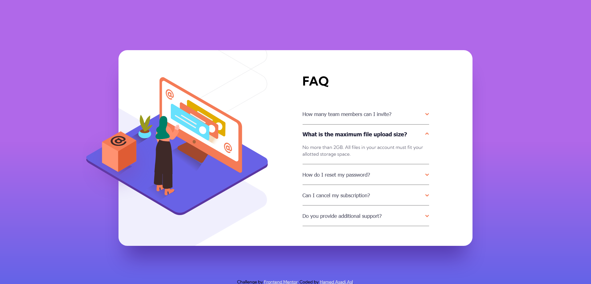

# FAQ accordion card solution
This is a solution to the [FAQ accordion card challenge on Frontend Mentor](https://www.frontendmentor.io/challenges/faq-accordion-card-XlyjD0Oam).

### The challenge
Users should be able to:
- View the optimal layout for the component depending on their device's screen size
- See hover states for all interactive elements on the page
- Hide/Show the answer to a question when the question is clicked

### Screenshot

### Links
- Live Site URL: [FAQ accordion card](https://hamed3958.github.io/FAQ-Accordion-Card/)

### Built with
- Semantic HTML5 markup
- CSS custom properties
- Flexbox
- Responsive Web Design
- JavaScript interactive behavior

## Author
- Website - [hamedasadiasl.ir](http://hamedasadiasl.ir/)
- Github - [@hamed3958](https://github.com/hamed3958)
- Frontend Mentor - [@hamed3958](https://www.frontendmentor.io/profile/hamed3958)
